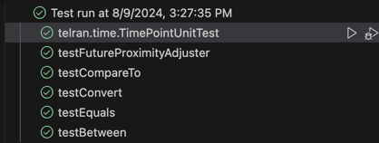

# HW 15 Solution:
class TimePointUnitTest
class TimePoint
enum TimeUnit
interface TimePointAdjuster
abstract method adjust
example of TimePointAdjuster implementation providing plus operation
class FutureProximityAdjuster implementing TimePointAdjuster

## Testing:

